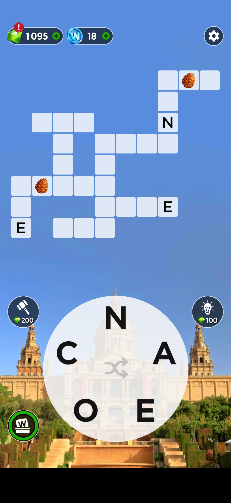
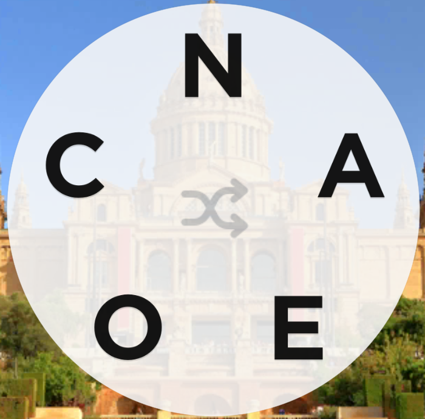

# WordsOfWonder (Android Game) Bot

Detect letters in current game and their coordinates on screen (opencv + pytesseract),
unscramble the letters to find all valid words from them (using an online word scrambler or GPT),
automatically perform swipe(drag) operations on mobile to complete the words! (using adb)

Game:

Then cut the letter wheel (not responsive, depends on my screen size):

After that, use opencv to find all contours and their coordinates, then, for each coordinate
run ``image_to_string`` from pytesseract to get the respective letter.

Note that the coordinates we've found are relative to that cutted image, not to our whole screen!
So we perform [domain expansion](https://youtu.be/gbRffuAZnnY?si=NVwxsdTGSAqFKGyV&t=62) to transform these coordinates
to our whole screen coordinates domain.

When we found all anagrams from the recognized letters, we use ADB (Android Debugging Bridge) for performing the necessary
drag actions to complete a word in the puzzle.
